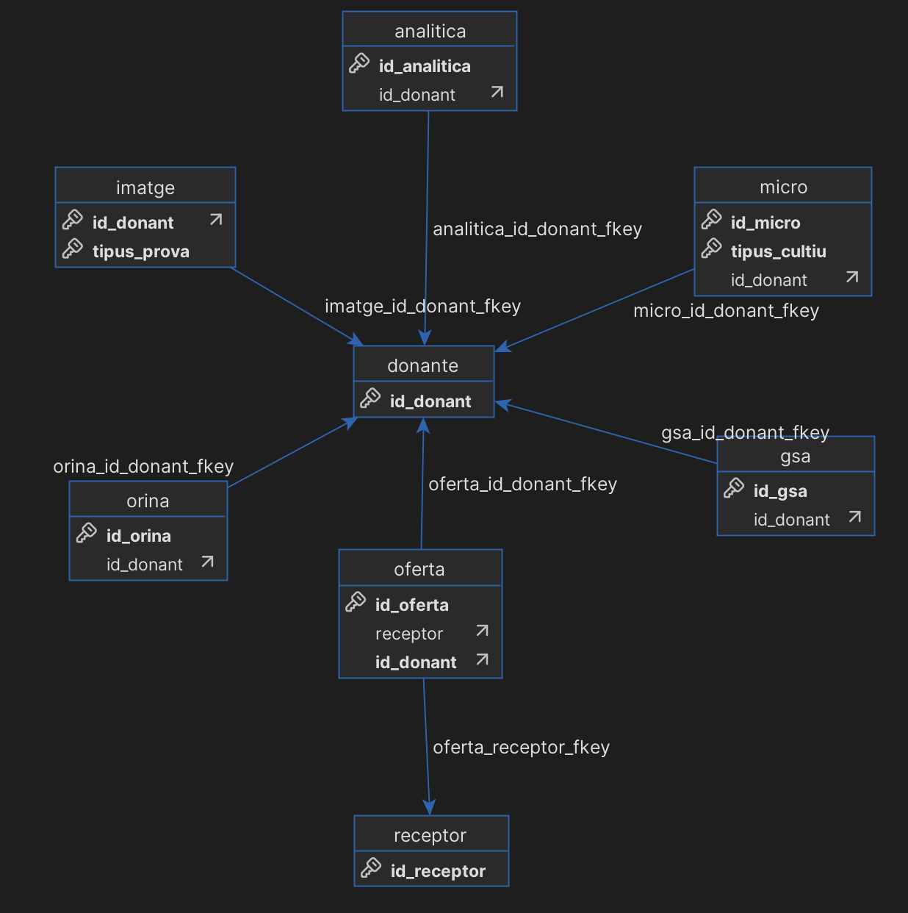

#  🏥  donor-db-clinic

## Description

`donor-db-clinic` is a Python project designed to extract, transform and load (ETL) data related to donor databases. The project handles data extraction from web services, transformation of the data, and loading into a PostgreSQL database.

## Installation

To install the project and its dependencies, use [Poetry](https://python-poetry.org/). Make sure Poetry is installed on your system.

1. Clone the repository:
    ```sh
    git clone https://github.com/AndreaTomas00/donor-db-clinic.git
    cd donor-db-clinic
    ```

2. Activate the environment
    ```sh
     eval $(poetry env activate)
    ```

3. Install dependencies:
    ```sh
    poetry install
    ```

## Usage

If using doker:

1. Build the app image
    ```sh
    docker-compose build app
    ````

2. Start the postgres container in the background
    ```sh
    docker-compose up -d postgres
    ````


## Pipeline Execution

You can run the ETL pipeline in two ways (example for dockerized project):

### Option 1: Using the Python script

```sh
docker-compose run --rm -it app python3 -m src.pipeline.pipeline  --start_date "01/01/2025" --end_date "31/12/2025"
```
Arguments:

- `--start_date`: Data extraction start date (default: "01/01/2025")
- `--end_date`: Data extraction end date (default: current date)

### Option 2: Using the CLI

```sh
docker-compose run python3 -m CLI.py pipeline
```

Both options create the final database but using the CLI provides more details abuot the process. 

## Database Design
The final database created follows this schema:
 

It creates a simple database design with one general donor table and related tables for analytics, urine tests, microbiology, and imaging. It also includes a table containig the organ offers for each donor.
It is a relational database where all tables are linked by `donor_id`. The table `Ofertas` woulb be linked to the recipient databases through the recipient id

## Data Processing Steps
### Data Extraction
To extract data independently:

```sh
docker-compose run --rm -it app python3 -m src.pipeline.CLI extract 
```
This command accepts a mode parameter:
- `--start_date`: Data extraction start date (default: "01/01/2025")
- `--end_date`: Data extraction end date (default: current date)
- `--queries:list`: List of queries to extract, separated by commas
If the queries list is not provided, the interface asks the user by showing the available queries.

The queries can be saved as they are extracted from the API, but the CLI also offers the user the option to transform them (get the DB structure). After the extraction (with or without transformation) the queries are saved in `csv` format.

If running in docker, use the following command so that the files are stored in local.
```bash
docker-compose run --rm -it -v $(pwd)/queries:/app/queries app python3 -m src.pipeline.CLI extract 
```

## Download Documents

Download documents from the RSA web service:

```bash
poetry run python CLI.py download-documents [OPTIONS]
```

Options:
- `--start-date TEXT`: Start date in DD/MM/YYYY format [default: 01/01/2025]
- `--end-date TEXT`: End date in DD/MM/YYYY format [default: current date]

Example:
```bash
poetry run python CLI.py download-documents --start-date 01/01/2025 --end-date 31/01/2025
```
The documents are stored and can be added into the database.

## Data Storage

During the ETL process, data is temporarily stored in the following locations:

- `Extracted data`: `DATA_ROOT/tmp/`
- `Transformed data`: `DATA_ROOT/transformed/`
- `Downloaded documents`: `DATA_ROOT/Documents/`

After successful execution, these files are removed. 

## Database exploring
When using docker use the following commands to connect to the database that has been created and explore it:

```bash
docker-compose exec -it postgres psql -U postgres -d donor_db
````

## Configuration
The project uses a Python configuration file and a YAML file (./src/params.yaml) containing dictionaries/lists necessary for data extraction and transformation.

## Dependencies
- pandas (>=2.2.3,<3.0.0)
- psycopg2 (>=2.9.10,<3.0.0)
- requests (>=2.32.3,<3.0.0)
- xmltodict (>=0.14.2,<0.15.0)
- python-dotenv (>=1.0.1,<2.0.0)
- pypdf2 (>=3.0.1,<4.0.0)
- loguru (==0.7.2)
- typer (>=0.15.1,<0.16.0)
- pyyaml (>=6.0.2,<7.0.0)
- pdfplumber (>=0.11.5,<0.12.0)
- Author

## Author
Andrea Tomas - andrea.tomas@estudiantat.upc.edu
